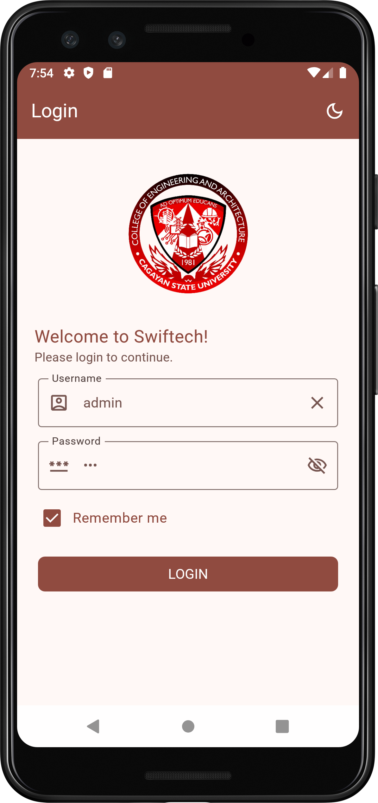
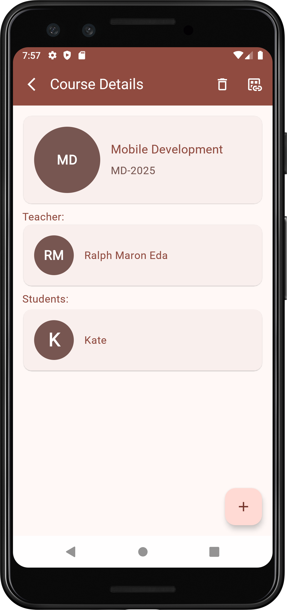

# 🎓 Swiftech

**Swiftech** is a mobile-first **teacher evaluation system** built with **Jetpack Compose Material 3
**, using **Room Database** and **MVVM architecture**. It enables students to evaluate their
instructors per course with a clean, Google Form–like UI. The system is currently offline-first and
admin-controlled—designed for a future cloud-enabled version.


---

## 🔗 Repository

GitHub: [https://github.com/ralphmarondev/Swiftech](https://github.com/ralphmarondev/Swiftech)

---

## 📸 Screenshots

Here’s a sneak peek of **Swiftech** in action:

<div align="center">
  
  
  
</div>

> 📌 *Simple, offline-ready evaluation platform with clean UI and role-based control.*

---

## ✨ Features

* 🔐 Admin-managed user system (no self-registration)
* 🧑‍🏫 Role-based access for Admin, Teacher, and Student
* 📋 Course-based teacher evaluation with 1–5 checkbox scale
* 📈 Teachers can view evaluation results (read-only)
* 🧰 Admin has full CRUD access to:

    * Students
    * Teachers
    * Courses
    * Evaluation Forms
* 💾 Offline-first with Room DB
* ⚙️ Built using clean MVVM pattern with Koin DI

---

## 🛠️ Getting Started

### 1. Clone the Repository

```bash
git clone https://github.com/ralphmarondev/Swiftech.git
cd Swiftech
```

### 2. Open in Android Studio

* Open the root project folder
* Let Gradle sync completely
* Run the app on your Android emulator or a connected device

---

## 📄 License

This project is licensed under the **MIT License**.
See the [LICENSE](LICENSE.txt) file for full details.

---

## 👤 Author

**Ralph Maron Eda**
GitHub: [@ralphmarondev](https://github.com/ralphmarondev)

---

## 🤝 Contributing

Suggestions and contributions are welcome!
Feel free to fork the project, submit issues, or open a pull request.
Let’s modernize academic feedback together. 🎓✨
